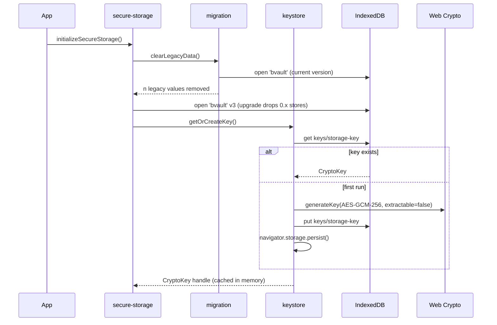
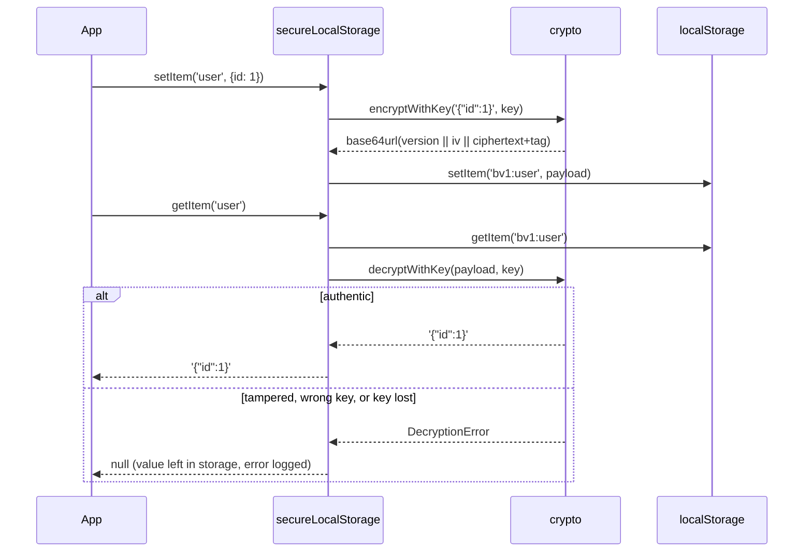

# How bVault-js works

This document explains what bVault-js does internally, what it protects
against, and where it stops. It is written for contributors and for anyone
evaluating the library for production use. It describes the 1.0 design
(non-extractable keys); see [issue #5](https://github.com/OSSAfrica/bvault-js/issues/5)
for why 0.x was replaced.

- [The idea in one paragraph](#the-idea-in-one-paragraph)
- [Architecture](#architecture)
- [Module tour](#module-tour)
- [Lifecycle](#lifecycle)
- [Payload format](#payload-format)
- [Strongholds](#strongholds)
- [Limitations](#limitations)
- [Where to start contributing](#where-to-start-contributing)

## The idea in one paragraph

On first run, bVault-js asks the browser to generate an AES-256-GCM key with
`extractable: false`. The browser keeps the key bytes to itself: JavaScript gets
a `CryptoKey` handle it can pass to `crypto.subtle.encrypt()` and
`crypto.subtle.decrypt()`, but it can never read the bytes, and
`crypto.subtle.exportKey()` rejects. The handle is structured-clonable, so
bVault-js stores it in IndexedDB and loads the same key on later page loads.
Every value your app writes through `secureLocalStorage` or
`secureSessionStorage` is encrypted under that key before it reaches
`localStorage` or `sessionStorage`. Someone who copies the storage gets only
ciphertext, and the key does not come with the copy.

## Architecture

```mermaid
flowchart TD

subgraph group_api["Storage API"]
  node_secure_storage["Secure Storage<br/>[secure-storage.ts]"]
  node_local_wrapper["Local Wrapper<br/>[secure-storage.ts]"]
  node_session_wrapper["Session Wrapper<br/>[secure-storage.ts]"]
  node_local_storage[("localStorage")]
  node_session_storage[("sessionStorage")]
end

subgraph group_crypto["Cryptography"]
  node_crypto_engine["Crypto Engine<br/>[crypto.ts]"]
  node_converters["Data Converters<br/>[converters.ts]"]
  node_crypto_errors["Crypto Errors<br/>[errors.ts]"]
  node_webcrypto{{"Web Crypto"}}
end

subgraph group_persistence["Key Persistence"]
  node_keystore["Key Store<br/>[keystore.ts]"]
  node_bvault_db["Database Wrapper<br/>[bvault-db.ts]"]
  node_indexeddb[("IndexedDB")]
  node_storage_manager{{"Storage Manager"}}
end

subgraph group_compatibility["Compatibility"]
  node_migration["Legacy Migration<br/>[migration.ts]"]
end

node_application(("Application"))

node_application -->|"initializes"| node_secure_storage
node_application -->|"reads/writes"| node_local_wrapper
node_application -->|"reads/writes"| node_session_wrapper
node_secure_storage -->|"clears legacy"| node_migration
node_secure_storage -->|"initializes"| node_bvault_db
node_secure_storage -->|"loads key"| node_keystore
node_secure_storage -->|"clears"| node_local_wrapper
node_secure_storage -->|"clears"| node_session_wrapper
node_secure_storage -->|"destroys key"| node_keystore
node_local_wrapper -->|"encrypts/decrypts"| node_crypto_engine
node_session_wrapper -->|"encrypts/decrypts"| node_crypto_engine
node_local_wrapper -->|"reads/writes"| node_local_storage
node_session_wrapper -->|"reads/writes"| node_session_storage
node_local_wrapper -->|"wraps errors"| node_crypto_errors
node_session_wrapper -->|"wraps errors"| node_crypto_errors
node_crypto_engine -->|"encrypts/decrypts"| node_webcrypto
node_crypto_engine -->|"encodes payloads"| node_converters
node_crypto_engine -->|"raises errors"| node_crypto_errors
node_keystore -->|"reads/writes key"| node_bvault_db
node_keystore -->|"generates key"| node_webcrypto
node_keystore -.->|"requests persistence"| node_storage_manager
node_bvault_db -->|"stores the key"| node_indexeddb
node_migration -->|"reads legacy keys"| node_indexeddb
node_migration -->|"removes legacy data"| node_local_storage
node_migration -->|"removes legacy data"| node_session_storage

click node_secure_storage "https://github.com/ossafrica/bvault-js/blob/main/src/lib/secure-storage.ts"
click node_local_wrapper "https://github.com/ossafrica/bvault-js/blob/main/src/lib/secure-storage.ts"
click node_session_wrapper "https://github.com/ossafrica/bvault-js/blob/main/src/lib/secure-storage.ts"
click node_crypto_engine "https://github.com/ossafrica/bvault-js/blob/main/src/lib/crypto.ts"
click node_converters "https://github.com/ossafrica/bvault-js/blob/main/src/lib/converters.ts"
click node_crypto_errors "https://github.com/ossafrica/bvault-js/blob/main/src/lib/errors.ts"
click node_keystore "https://github.com/ossafrica/bvault-js/blob/main/src/lib/keystore.ts"
click node_bvault_db "https://github.com/ossafrica/bvault-js/blob/main/src/lib/bvault-db.ts"
click node_migration "https://github.com/ossafrica/bvault-js/blob/main/src/lib/migration.ts"

classDef toneNeutral fill:#f8fafc,stroke:#334155,stroke-width:1.5px,color:#0f172a
classDef toneBlue fill:#dbeafe,stroke:#2563eb,stroke-width:1.5px,color:#172554
classDef toneAmber fill:#fef3c7,stroke:#d97706,stroke-width:1.5px,color:#78350f
classDef toneMint fill:#dcfce7,stroke:#16a34a,stroke-width:1.5px,color:#14532d
classDef toneRose fill:#ffe4e6,stroke:#e11d48,stroke-width:1.5px,color:#881337
classDef toneIndigo fill:#e0e7ff,stroke:#4f46e5,stroke-width:1.5px,color:#312e81
classDef toneTeal fill:#ccfbf1,stroke:#0f766e,stroke-width:1.5px,color:#134e4a
class node_secure_storage,node_local_wrapper,node_session_wrapper,node_local_storage,node_session_storage toneBlue
class node_crypto_engine,node_converters,node_crypto_errors,node_webcrypto toneAmber
class node_keystore,node_bvault_db,node_indexeddb,node_storage_manager toneMint
class node_migration toneRose
class node_application toneIndigo
```



The library has four layers:

| Layer           | Colour | Files                                     | Job                                                            |
| --------------- | ------ | ----------------------------------------- | -------------------------------------------------------------- |
| Storage API     | Blue   | `secure-storage.ts`                       | The public surface. Wraps `localStorage` and `sessionStorage`. |
| Cryptography    | Amber  | `crypto.ts`, `converters.ts`, `errors.ts` | Turns a string into a versioned, authenticated payload.        |
| Key Persistence | Green  | `keystore.ts`, `bvault-db.ts`             | Creates the key once and keeps it in IndexedDB.                |
| Compatibility   | Rose   | `migration.ts`                            | Removes data left by 0.x, which cannot be decrypted any more.  |

The key lives in IndexedDB, and the encrypted values live in Web Storage. They
are kept in different places on purpose. Values stay synchronous-shaped and
cheap to read, and the key never sits next to the ciphertext in a store an
attacker is likely to dump.

## Module tour

### `src/index.ts`

The public API: `initializeSecureStorage`, `secureLocalStorage`,
`secureSessionStorage`, `destroySecureStorage`, `isSecureStorageInitialized`,
`EncryptionError` and `DecryptionError`. Nothing else is exported. `encrypt` and
`decrypt` were removed in 1.0 so that the library does one job.

### `src/lib/secure-storage.ts`

The orchestrator and the wrappers.

- `initializeSecureStorage()` runs the migration, opens the database, loads or
  creates the key, and caches it in module state.
- `createSecureSetItem`, `createSecureGetItem`, `createSecureRemoveItem` and
  `createSecureClear` are factories. Each is called once with `'local'` and
  once with `'session'`, so the two wrappers share one implementation.
- Every key is written under the `bv1:` prefix. `clear()` removes only
  prefixed keys, so bVault-js never touches data owned by other code.
- `getStorage()` reads `globalThis.localStorage` lazily, which keeps
  `import 'bvault-js'` from throwing under server-side rendering.
- Objects are passed through `JSON.stringify` before encryption. Everything
  else goes through `String()`.

### `src/lib/crypto.ts`

`encryptWithKey(data, key)` and `decryptWithKey(payload, key)`. It generates a
fresh 96-bit IV with `crypto.getRandomValues` on every call and prepends a
version byte and the IV to the ciphertext. See
[Payload format](#payload-format). `isCurrentFormat()` checks the version byte.

### `src/lib/converters.ts`

UTF-8 and base64url helpers. `bufferToBase64` converts in 8 KiB chunks. Spreading
a whole array into `String.fromCharCode` overflows the call stack on payloads
above about 100 KB.

### `src/lib/errors.ts`

`EncryptionError` and `DecryptionError`. Both extend a shared `CryptoError` that
keeps a `cause`, an optional `context` object (for example `{ target, key }`)
and a `toJSON()` method for logging.

### `src/lib/keystore.ts`

- `getOrCreateKey()` returns the cached key, or the key stored in IndexedDB, or
  generates a new non-extractable AES-GCM-256 key, stores it, and calls
  `navigator.storage.persist()`.
- `destroyKey()` deletes the key record. Every value encrypted under it becomes
  permanently unreadable.
- `hasKey()` and `resetKeyCache()` are used by the tests.

### `src/lib/bvault-db.ts`

A small promise wrapper around IndexedDB. It opens database `bvault` at schema
version 3 with one object store, `keys`, which holds a single record,
`storage-key`. The upgrade handler deletes stores that are not in the schema,
which removes the 0.x `encryption_metadata_*` stores.

### `src/lib/migration.ts`

0.x derived keys from a password or a browser fingerprint. Those keys cannot be
recovered, so 0.x data cannot be migrated. `clearLegacyData()` opens the
database at its current version, reads the item keys that 0.x recorded in its
metadata stores, and removes only those entries from Web Storage. Anything else
in storage is left alone, and a warning is logged if something was removed.

## Lifecycle

### Initialization



### Writing and reading a value



`getItem` returns a string. If you stored an object, call `JSON.parse` on the
result.

Every failed read logs a `console.error`. The first `DecryptionError` also logs
a one-time warning that the key may have been cleared or evicted.

### Destroying

`destroySecureStorage()` removes every `bv1:` entry from both storages, deletes
the key from IndexedDB, and resets the in-memory state. Use it for logout or
when switching accounts. Nothing can be recovered afterwards.

## Payload format

Each stored value is one base64url string (no padding):

```
+---------+----------------+------------------------------+
| version | IV             | AES-GCM ciphertext + 16B tag |
| 1 byte  | 12 bytes       | n + 16 bytes                 |
+---------+----------------+------------------------------+
  0x01
```

- The **version byte** lets the format change later without guessing. A value
  with any other first byte is rejected.
- The **IV** travels with the ciphertext, so a read needs no IndexedDB lookup.
  It is random for every write. The key lasts a long time, and reusing an IV
  under one AES-GCM key breaks both confidentiality and integrity.
- The **tag** means a changed byte causes a `DecryptionError`, never garbage
  output.

## Strongholds

What bVault-js does well:

1. **Copied storage is useless elsewhere.** The key is non-extractable, so a
   dump of `localStorage` or `sessionStorage` can't be decrypted in another
   browser, and a token stored this way can't be replayed from a stolen copy.
   Session tokens are still safer in `httpOnly` cookies (see
   [Limitations](#limitations)).
2. **Code that reads only Web Storage gets ciphertext.** A script or extension
   that scrapes storage (`JSON.stringify(localStorage)`) reads nothing useful.
   This protection is narrow: any script running in the same origin, such as an
   analytics tag or an injected extension script, can open the `bvault`
   IndexedDB database, take the `CryptoKey` handle and decrypt everything.
3. **Nothing readable at rest in Web Storage.** DevTools and casual inspection
   show only base64url blobs.
4. **XSS can't take the key away.** Injected script can _use_ the key while it
   runs on the page, but it can't _take_ the key for offline or cross-browser
   use, so its use of the key ends when the script stops running. While it
   runs, though, it can read every value.
5. **Authenticated encryption.** AES-256-GCM with a 128-bit tag. Tampered
   values or values encrypted under another key are rejected.
6. **Full-entropy key.** The browser generates the key, so there's no password
   to guess and no fingerprint to recompute. The key doesn't change when the
   browser updates.
7. **Fails without destroying data.** `getItem` never deletes a value it can't
   decrypt, so a transient error can't cost the user data.
8. **Stays out of other code's way.** The `bv1:` prefix keeps it from colliding
   with other data in the same origin. `clear()` and the migration only remove
   entries bVault-js wrote.
9. **Safe under SSR.** Importing is side-effect free, and storage is read only
   when it's used.
10. **Small.** Zero runtime dependencies. All crypto is done by the browser's
    own Web Crypto implementation.

## Limitations

Read these before adopting bVault-js.

### By design

- **It doesn't stop live XSS.** Script running in your origin can call
  `secureLocalStorage.getItem()` just like your code can. bVault-js reduces the
  damage from stolen storage. It doesn't replace a Content Security Policy,
  output encoding, or `httpOnly` cookies for session tokens.
- **Non-extractable doesn't mean encrypted at rest.** The key is protected by
  an API restriction, not by encryption. A native process that can read the
  browser profile (malware, forensic tools, a copied profile folder) can get
  the key from IndexedDB's files. Firefox tracks this as
  [bug 1556794](https://bugzilla.mozilla.org/show_bug.cgi?id=1556794). Full-disk
  encryption helps; hardware-backed derivation such as the
  [WebAuthn PRF extension](https://developers.yubico.com/WebAuthn/Concepts/PRF_Extension/)
  would close the gap ([#13](https://github.com/OSSAfrica/bvault-js/issues/13)).
- **Losing the key loses all data.** There's no password, so nothing can be
  recovered. Clearing site data, private-browsing sessions ending, or the
  browser evicting storage under pressure all make every value permanently
  unreadable. `navigator.storage.persist()` is requested, but browsers may
  refuse it. Only store data you can fetch again.
- **Safari deletes everything after 7 days of browser use without interaction
  with the site**, both the key and the ciphertext. Home-screen web apps are exempt.
- **One key per origin.** Every tab, and all code in the origin, shares one key.
  There's no per-user or per-namespace key. Use `destroySecureStorage()` when
  the user changes.
- **The key is tied to one browser profile.** Values can't be synced across
  devices or browsers, and they can't be decrypted on a server.
- **Not suitable for passwords or long-lived secrets** that must survive losing
  the key. Treat it as an encrypted cache.

### Current gaps (fixable)

These are known weaknesses of the current code, not of the design. Each one
has an issue open for contributors.

- **Values aren't bound to their key name ([#12](https://github.com/OSSAfrica/bvault-js/issues/12)).** The storage key isn't passed to
  AES-GCM as additional authenticated data. Someone who can _write_ to storage
  can move a valid ciphertext from one key to another (for example, copy
  `bv1:a` over `bv1:b`), or restore an old value, and it will still decrypt.
- **Initialization races ([#8](https://github.com/OSSAfrica/bvault-js/issues/8)).** Two tabs opening at the same time on first run, or
  two concurrent `initializeSecureStorage()` calls in one tab (for example a
  React StrictMode double effect), can each generate a key. The last write to
  IndexedDB wins. Values written by the losing caller can't be read after a
  reload.
- **`destroySecureStorage()` isn't broadcast ([#9](https://github.com/OSSAfrica/bvault-js/issues/9)).** Other open tabs keep the old key
  in memory and keep writing values that no key can decrypt.
- **IndexedDB `blocked` and `versionchange` events aren't handled ([#10](https://github.com/OSSAfrica/bvault-js/issues/10)).** A tab
  running an older version can make initialization hang. If the schema check
  finds a store missing, the whole database is deleted, and the key goes with
  it.
- **`getItem` returns `null` for two different cases ([#14](https://github.com/OSSAfrica/bvault-js/issues/14)).** A missing value and a
  value that can't be decrypted look the same to the caller.
- **Values come back as strings ([#15](https://github.com/OSSAfrica/bvault-js/issues/15)).** Objects need `JSON.parse`. `undefined`
  becomes the string `"undefined"`. `Date`, `Map` and similar types lose their
  type.
- **Storage-full errors are reported as `EncryptionError` ([#11](https://github.com/OSSAfrica/bvault-js/issues/11)).** A
  `QuotaExceededError` from Web Storage is hard to tell apart from a crypto
  failure.
- **Tests run in jsdom with `fake-indexeddb` ([#18](https://github.com/OSSAfrica/bvault-js/issues/18)).** Nothing yet checks how real
  Chromium, Firefox or WebKit store non-extractable keys.
- **Web Storage limits still apply.** Web Storage is synchronous, limited to
  about 5 MB per origin, and not shared with Web Workers. Encryption and base64
  add 29 bytes (header, IV and tag) to each value, then make it about a third larger.

## Where to start contributing

- Read [`src/lib/secure-storage.ts`](../src/lib/secure-storage.ts) first. It
  shows how the other modules fit together.
- Run `npm install` and `npm run test:run`. The tests in `test/secure-storage.test.ts`
  describe the behaviour the library promises.
- Look for issues labelled
  [`good first issue`](https://github.com/OSSAfrica/bvault-js/labels/good%20first%20issue).
- Every commit needs a `Signed-off-by` line (`git commit -s`). See
  [DCO.md](../DCO.md).
- Changes to the crypto or key handling need a test showing the property still
  holds. The existing tests for non-extractability, tampering and IV uniqueness
  are good models.
